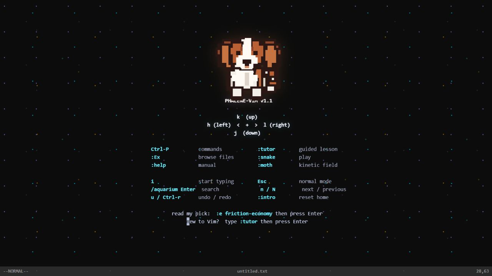

  

<h1 align="center">jory</h1>

  I build developer tools and interfaces that make complex systems easier to use. 
  I scaled a real-time multiplayer physics game to 47M+ downloads.

  <a href="https://jorypestorious.com/">website</a> ·
  <a href="https://www.linkedin.com/in/jory-fullstack-engineer/">linkedin</a> ·
  <a href="mailto:jory@pestorious.com">email</a>

## Phalene-Vim

A browser-based Vim environment with normal-mode editing, a guided tutor, file browser, command palette, Snake, and a kinetic moth field. [Open it and press some keys.](https://jorypestorious.com/vim/)

## Selected work

### [dadbod-grip.nvim](https://github.com/joryeugene/dadbod-grip.nvim)

Edit database tables like Vim buffers. Stage mutations, preview SQL live, undo transactions, and move through schema relationships across PostgreSQL, SQLite, MySQL, DuckDB, and MotherDuck.

### [Georgie the Phalène](https://github.com/joryeugene/georgie-phalene-codex-pet)

An animated Codex pet with a complete action set, motion checks, and reusable tooling for spritesheet QA.

## Writing

- [AI Engineer World's Fair 2026: Takeaways & Verification](https://jorypestorious.com/blog/ai-engineer-verification/)
- [Complexity Protects Itself](https://jorypestorious.com/blog/complexity-protects-itself/)
- [Friction Economy: Unconscious Productivity Drains in Development Workflows](https://jorypestorious.com/blog/friction-economy/)

[Read all writing](https://jorypestorious.com/blog/)
