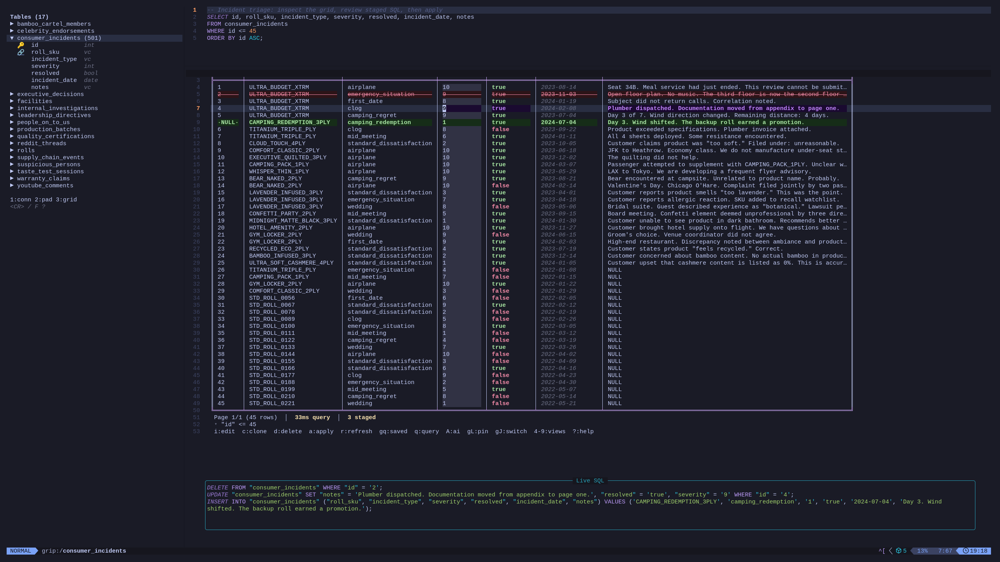
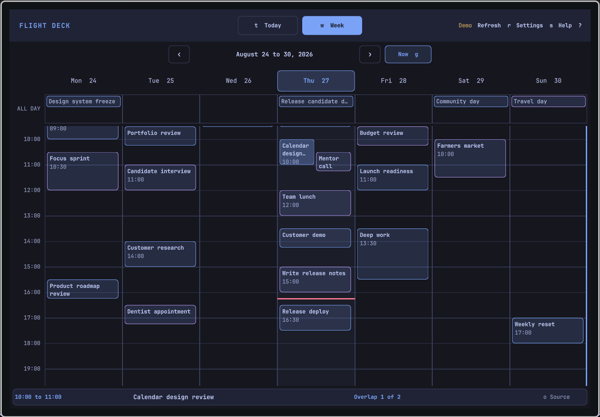

# Jory Pestorious

I build ambitious software where the interface and the engineering carry equal weight.

I co-founded We’re Five Games and led multiplayer for Totally Reliable Delivery Service, which passed 50 million downloads. [See the engineering trace.](https://jorypestorious.com/process/#totally-reliable)

[Website](https://jorypestorious.com/) · [Contact](https://jorypestorious.com/contact/) · [LinkedIn](https://www.linkedin.com/in/jory-fullstack-engineer/) · [Email](mailto:jory@pestorious.com)

 

## Projects

### [dadbod-grip.nvim](https://github.com/joryeugene/dadbod-grip.nvim)

Edit database tables like Vim buffers. Browse schemas, stage row mutations, inspect generated SQL, and work across PostgreSQL, SQLite, MySQL, DuckDB, and MotherDuck.

### [Flight Deck Calendar](https://github.com/joryeugene/omarchy-calendar)

  

A keyboard-first Google and Outlook calendar cockpit built into Omarchy. Read-only, locally cached, and backed by system-keyring credentials.

### [Phalene-Vim](https://jorypestorious.com/vim/)

  

A browser-based Vim environment with normal-mode editing, a guided tutor, file browser, command palette, Snake, and a kinetic moth field. [Open it and press some keys.](https://jorypestorious.com/vim/)

## Writing

- [AI Engineer World's Fair 2026: Takeaways & Verification](https://jorypestorious.com/blog/ai-engineer-verification/)
- [Complexity Protects Itself](https://jorypestorious.com/blog/complexity-protects-itself/)
- [Friction Economy: Unconscious Productivity Drains in Development Workflows](https://jorypestorious.com/blog/friction-economy/)

[Read all writing](https://jorypestorious.com/blog/)
