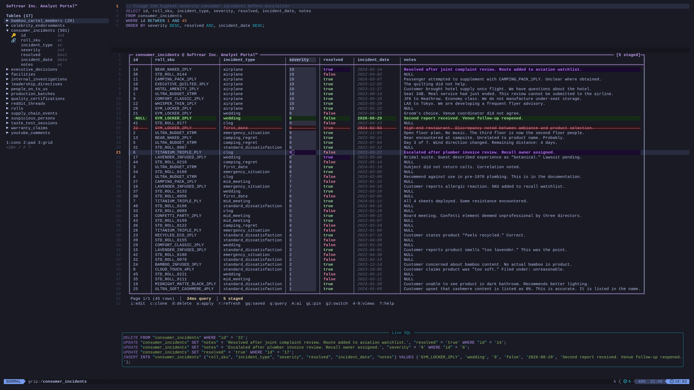
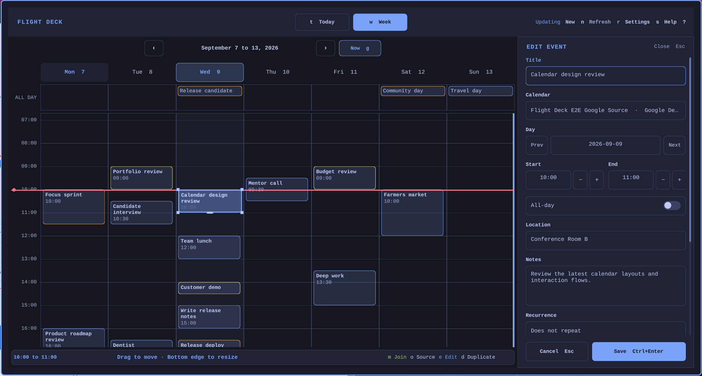
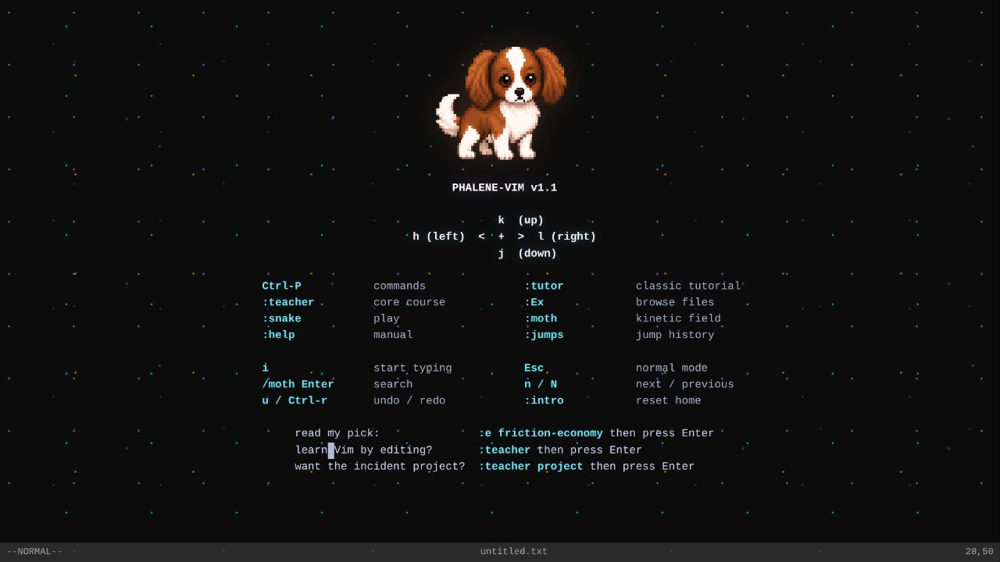

# Jory Pestorious

I co-founded We’re Five Games and led multiplayer for Totally Reliable Delivery Service, which passed 50 million downloads. [See the engineering trace.](https://jorypestorious.com/process/#totally-reliable)

[Website](https://jorypestorious.com/) · [Contact](https://jorypestorious.com/contact/) · [LinkedIn](https://www.linkedin.com/in/jory-fullstack-engineer/) · [Email](mailto:jory@pestorious.com)

 

## Projects

### [dadbod-grip.nvim](https://github.com/joryeugene/dadbod-grip.nvim)

Dadbod Grip turns database tables into Vim buffers. It keeps schema browsing, staged mutations, and generated SQL in one Neovim workspace across PostgreSQL, SQLite, MySQL, DuckDB, and MotherDuck.

### [Flight Deck Calendar](https://calendar.pestorious.com/)

  

Flight Deck Calendar brings Google Calendar and Outlook into one keyboard-first Omarchy panel. Accounts remain read-only until editing is enabled, and saved changes go directly to the selected provider. The right-side editor keeps the calendar visible while a local draft changes.

[Product](https://calendar.pestorious.com/) · [Source](https://github.com/joryeugene/omarchy-calendar) · [Privacy](https://calendar.pestorious.com/privacy/) · [v1.1.0](https://github.com/joryeugene/omarchy-calendar/releases/tag/v1.1.0)

### [Phalene-Vim](https://jorypestorious.com/vim/)

  

Phalene-Vim teaches normal-mode editing inside a browser editor that checks what the learner changed. It includes a guided tutor, file browser, command palette, Snake, and a kinetic moth field. [Open it and press some keys.](https://jorypestorious.com/vim/)

## Writing

- [AI Engineer World's Fair 2026: Takeaways & Verification](https://jorypestorious.com/blog/ai-engineer-verification/)
- [Complexity Protects Itself](https://jorypestorious.com/blog/complexity-protects-itself/)
- [Friction Economy: Unconscious Productivity Drains in Development Workflows](https://jorypestorious.com/blog/friction-economy/)

[Read all writing](https://jorypestorious.com/blog/)
